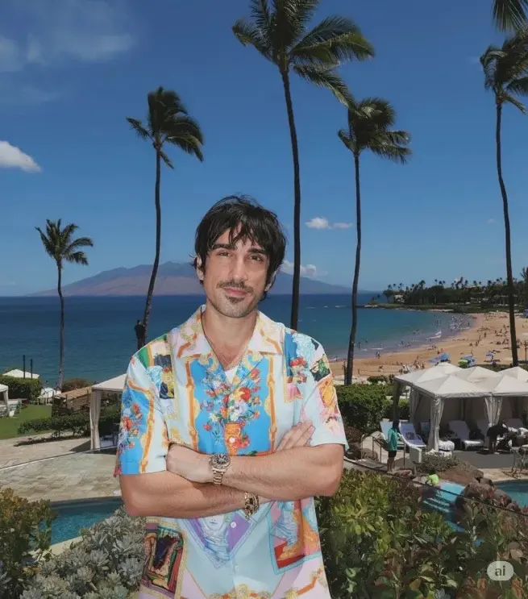

<div align="center">

# Awesome Nano Banana Pro Prompts


</div>

## Introduction 🍌

A curated collection of creative prompts for **Nano Banana Pro**, the advanced evolution of Google DeepMind's image generation technology. Designed to push the boundaries of imagination, this repository helps you unlock the full potential of AI-driven visual creation with professional-grade results.

Welcome to `awesome-nano-banana-pro-prompts`! Nano Banana Pro represents a leap forward in visual reasoning and multi-turn conversational image editing. Whether you are a designer, artist, or enthusiast, these prompts are crafted to showcase the superior detail, coherence, and flexibility of the Pro model.

## Mission ✨

* **Master Advanced Capabilities**: Provide complex and nuanced prompt examples to demonstrate the enhanced power of Nano Banana Pro.
* **Accelerate Creation**: Offer production-ready prompts that streamline workflows and deliver high-fidelity results instantly.
* **Empower the Community**: Foster a collaborative environment where creators can share professional techniques and inspire the next wave of AI art.

---

## Directory

- [Awesome Nano Banana Pro Prompts](#awesome-nano-banana-pro-prompts)
  - [Introduction 🍌](#introduction-)
  - [Mission ✨](#mission-)
  - [Directory](#directory)
  - [Cases](#cases)
    - [Case 16: Surreal Product Advertisement](#case-16-surreal-product-advertisement-by-aziz4ai)
    - [Case 15: High-End Portrait Enhancement](#case-15-high-end-portrait-enhancement-by-halimalrasihi)
    - [Case 14: Historical Photo Colorization](#case-14-historical-photo-colorization-by-codebypoonam)
    - [Case 13: Chibi Style LINE Stickers](#case-13-chibi-style-line-stickers-by-0uhly2vack23204)
    - [Case 12: Cinematic Editorial Portrait](#case-12-cinematic-editorial-portrait-by-john_my07)
    - [Case 11: Basement Gym Floor Plan](#case-11-basement-gym-floor-plan-by-adamwathan)
    - [Case 10: Train Station Movie Poster](#case-10-train-station-movie-poster-by-ai_kei75)
    - [Case 9: Comic Convention Booth](#case-9-comic-convention-booth-by-tokyo_valentine)
    - [Case 8: Manga Style Conversion](#case-8-manga-style-conversion-by-nobisiro_2023)
    - [Case 7: Character Clothing Change](#case-7-character-clothing-change-by-skirano)
    - [Case 6: Photo of Two Characters](#case-6-photo-of-two-characters-by-zho_zho_zho)
    - [Case 5: Designated Reference Pose for Character](#case-5-designated-reference-pose-for-character-by-zho_zho_zho)
    - [Case 4: Photorealistic 3D Rendering](#case-4-photorealistic-3d-rendering-by-tetumemo)
    - [Case 3: High-End Adorable Product Ads](#case-3-high-end-adorable-product-ads-by-azed_ai)
    - [Case 2: 16-Bit Platform Video Game](#case-2-16-bit-platform-video-game-by-priya_0608)
    - [Case 1: Pet to Plastic Action Figure](#case-1-pet-to-plastic-action-figure-by-geminiapp)
      
## Cases

### Case 16: [Surreal Product Advertisement](https://x.com/aziz4ai/status/1991584744375779672) (by [@aziz4ai](https://x.com/aziz4ai))

| Input | Output |
|:---:|:---:|
|  |  |

**input:** Need to upload a reference image

**prompt:**

```
Design a creative, realistic, and surreal advertisement for the product [Product Name] of the category [Product Type]. The product appears as a hero element in the center of the frame, visually formed in a clever way that automatically reflects the brand's spirit and identity.
A clean background consistent with brand colors, soft cinematic lighting, hyper-realistic textures, precise shadows, and a sophisticated and excellent visual composition.
Add an innovative surreal touch directly related to the nature of the product without exaggeration.
Place the product logo elegantly and integrated within the composition, with a short Arabic slogan of three words automatically generated to suit the product type.
Very high quality, precise composition, strong realism, luxury style, with no additional text other than the logo and the slogan.
```

### Case 15: [High-End Portrait Enhancement](https://x.com/HalimAlrasihi/status/1991581963275342330) (by [@HalimAlrasihi](https://x.com/HalimAlrasihi))

| Input | Output |
|:---:|:---:|
|  |  |

**input:** Need to upload a reference image

**prompt:**

```
Enhance and upscale the image while keeping composition and colors identical. Eliminate blur and give the skin a lifelike, detailed look: clear pores, faint fine lines, light freckles, and realistic transitions between shadow and highlight. Maintain the tone of the light and the background, refine edge sharpness around eyes, lashes, lips and hair strands so the portrait appears like a high-end beauty photograph with natural, unplastic skin.
```

### Case 14: [Historical Photo Colorization](https://x.com/CodeByPoonam/status/1991787621916487698) (by [@CodeByPoonam](https://x.com/CodeByPoonam))

| Input | Output |
|:---:|:---:|
|  |  |

**input:** Need to upload a reference image

**prompt:**

```
Colorize this old black-and-white photograph with natural, true-to-life colors. Preserve the original facial features, textures, lighting, shadows, and fine details. Restore any faded or damaged areas without changing the people, clothing, background, or composition. Maintain the sharpness and overall quality of the original image. Add realistic skin tones, accurate clothing colors, and natural background colors while keeping everything historically appropriate. Avoid adding or removing any elements.
```

### Case 13: [Chibi Style LINE Stickers](https://x.com/0uhly2VacK23204/status/1991780261068226776) (by [@0uhly2VacK23204](https://x.com/0uhly2VacK23204))

| Input | Output |
|:---:|:---:|
|  |  |

**input:** Need to upload a reference image

**prompt:**

```
Make the character in the image chibi style.  Generate 12 kinds of LINE stickers featuring various expressions, poses, and text.
```

### Case 12: [Cinematic Editorial Portrait](https://x.com/john_my07/status/1992231812878487620) (by [@john_my07](https://x.com/john_my07))

| Input | Output |
|:---:|:---:|
|  |  |

**input:** Need to upload a reference image

**prompt:**

```
A cinematic close-up editorial portrait of a slim young adult man with the user’s face as the main subject, wearing a sleek black suit, dark blazer, and black turtleneck, , direct gaze with subtle smirk, seamless vivid orange studio background, 85mm lens, f/4, ISO 100, shutter 1/200s, cinematic dual-tone lighting with warm orange glow and cool blue rim highlights.
```

### Case 11: [Basement Gym Floor Plan](https://x.com/adamwathan/status/1992335982709055658) (by [@adamwathan](https://x.com/adamwathan))

| Input | Output |
|:---:|:---:|
|  |  |

**input:** Need to upload a reference image

**prompt:**

```
generate an overhead floor plan layout style image of my basement gym
```

### Case 10: [Train Station Movie Poster](https://x.com/AI_Kei75/status/1967498630467625127) (by [@AI_Kei75](https://x.com/AI_Kei75))

| Input | Output |
|:---:|:---:|
|  |  |

**input:** Need to upload reference image

**prompt:**

```
Create a movie poster using the original image. The genre of the movie will be determined based on the atmosphere of the original image.
Regardless of whether the original image is anime or live-action, the style and character design of the original image will be maintained as perfectly as possible. However, poses and expressions may be changed to match the poster design. Other people and objects may also be added at this time.
The final generated image will be photorealistic. This does not apply to the poster design, as it will be based on the original image.
The scenery of the underground passage of a Japanese station where the poster is posted will be recreated in a realistic image. People passing through the underground passage will be added.
The reflection of the poster is angled to make it look more realistic.
```

### Case 9: [Comic Convention Booth](https://x.com/tokyo_Valentine/status/1967174466636792287) (by [@tokyo_Valentine](https://x.com/tokyo_Valentine))

| Input | Output |
|:---:|:---:|
|  |  |

**input:** Need to upload reference image

**prompt:**

```
Erase the background and replace the characters with the following:

Cosplayers and Character Goods

Character/Motif:
Character goods based on the illustration

Hairstyle, Eyes, and Appearance:
(Focus on merchandise, not the character itself.)

Main Character: A cosplayer is holding a figurine in the center of the screen.

Location:
Comic Market (a doujinshi sales event).
A spacious booth is filled with merchandise lined up on tables and shelves. The atmosphere is filled with excitement and anticipation.

Merchandise Lineup:
• A large, approximately 100cm figure is displayed in the center of the booth, creating an eye-catching display.
• The character is displayed on an 80-inch LCD panel.
• Acrylic Stands
• Chibi Figures (Deformed)
• Body Pillows (Large, Full-Length Character Print)
• Jigsaw Puzzles (Using Character Artwork)
• Stationery (Notebooks, Pens, Clear Files, etc.)
• Desk Pads
• Plush Toys (Deformed)
Exhibition/Display:
• Goods neatly arranged throughout the booth, creating a unified look.
• Utilizing desks and shelves reminiscent of doujinshi sales events, the layout encourages fans to pick up items.
• With the energy of the visitors as a backdrop, the venue is presented as a special "fan sanctuary."
Overall Tone:
A dreamlike sales space.
While emphasizing cuteness and pop, the space evokes the unique enthusiasm of doujin events and the feeling of a "sanctuary for fan activities."
Swarms of people.

Image Quality:
Photorealistic, 4K (4000px x 3000px)
```

### Case 8: [Manga Style Conversion](https://x.com/nobisiro_2023/status/1961231347986698371) (by [@nobisiro_2023](https://x.com/nobisiro_2023))

| Input | Output |
|:---:|:---:|
|  |  |

**input:** Need to upload reference image

**prompt:**

```
Convert the input photo into a black-and-white manga-style line drawing.
```

### Case 7: [Character Clothing Change](https://x.com/skirano/status/1960343968320737397) (by [@skirano](https://x.com/skirano))

| Input | Output |
|:---:|:---:|
|  |  |

**input:**Need to upload person image and clothing image

**prompt:**

```
Replace the person's clothing in the input image with the target clothing shown in the reference image. Keep the person's pose, facial expression, background, and overall realism unchanged. Make the new outfit look natural, well-fitted, and consistent with lighting and shadows. Do not alter the person's identity or the environment — only change the clothes.
```

### Case 6: [Photo of Two Characters](https://x.com/ZHO_ZHO_ZHO/status/1967521065883856984) (by [@ZHO_ZHO_ZHO](https://x.com/ZHO_ZHO_ZHO))

| Input | Output |
|:---:|:---:|
|  |  |
|  |  |

**input:** Need to upload two reference image

**prompt:**

```
Generate a close-up Polaroid photo of two people, keeping the faces consistent. The photo has a slight blur effect and is taken indoors with a flash, just like a party, with the two people keeping an intimate and funny pose.
```

### Case 5: [Designated Reference Pose for Character](https://x.com/ZHO_ZHO_ZHO/status/1961024423596872184) (by [@ZHO_ZHO_ZHO](https://x.com/ZHO_ZHO_ZHO))

| Input | Output |
|:---:|:---:|
|  |  |
|  |  |

**input:** Need to upload two reference image

**prompt:**

```
Change the pose of the person in Picture 1 to that in Picture 2, and shoot in a professional studio.
```

### Case 4: [Photorealistic 3D Rendering](https://x.com/tetumemo/status/1965660428765417721) (by [@tetumemo](https://x.com/tetumemo))

| Input | Output |
|:---:|:---:|
|  |  |
|  |  |

**input:** Need to upload a reference image

**prompt:**

```
Please convert all of this house's floor plans into a photorealistic 3D rendering in isometric projection while keeping the overhead view, and generate the image.
```

### Case 3: [High-End Adorable Product Ads](https://x.com/azed_ai/status/1962878353784066342) (by [@azed_ai](https://x.com/azed_ai))

| Input | Output |
|:---:|:---:|
|  |  |
|  |  |

**input:** Need to upload a reference image

**prompt:**

```
A high-resolution advertising photograph of a realistic, miniature [PRODUCT] held delicately between a person's thumb and index finger.  clean and white background, studio lighting, soft shadows. The hand is well-groomed, natural skin tone, and positioned to highlight the product’s shape and details. The product appears extremely small but hyper-detailed and brand-accurate, centered in the frame with a shallow depth of field. Emulates luxury product photography and minimalist commercial style.
```

### Case 2: [16-Bit Platform Video Game](https://x.com/Priya_0608/status/1962605608642699308) (by [@Priya_0608](https://x.com/Priya_0608))

| Input | Output |
|:---:|:---:|
|  |  |
|  |  |

**input:** Need to upload a reference image

**prompt:**

```
First, ask me to upload an image of myself. Then reimagine me as a 16-Bit Video Game character and put me in a 2D 16-bit platform video game.
```

### Case 1: [Pet to Plastic Action Figure](https://x.com/GeminiApp/status/1965842484854186159) (by [@GeminiApp](https://x.com/GeminiApp))

| Input | Output |
|:---:|:---:|
|  |  |
|  |  |

**input:** Need to upload a reference image

**prompt:**

```
turn my pet into a plastic action figure next to its packaging
```
