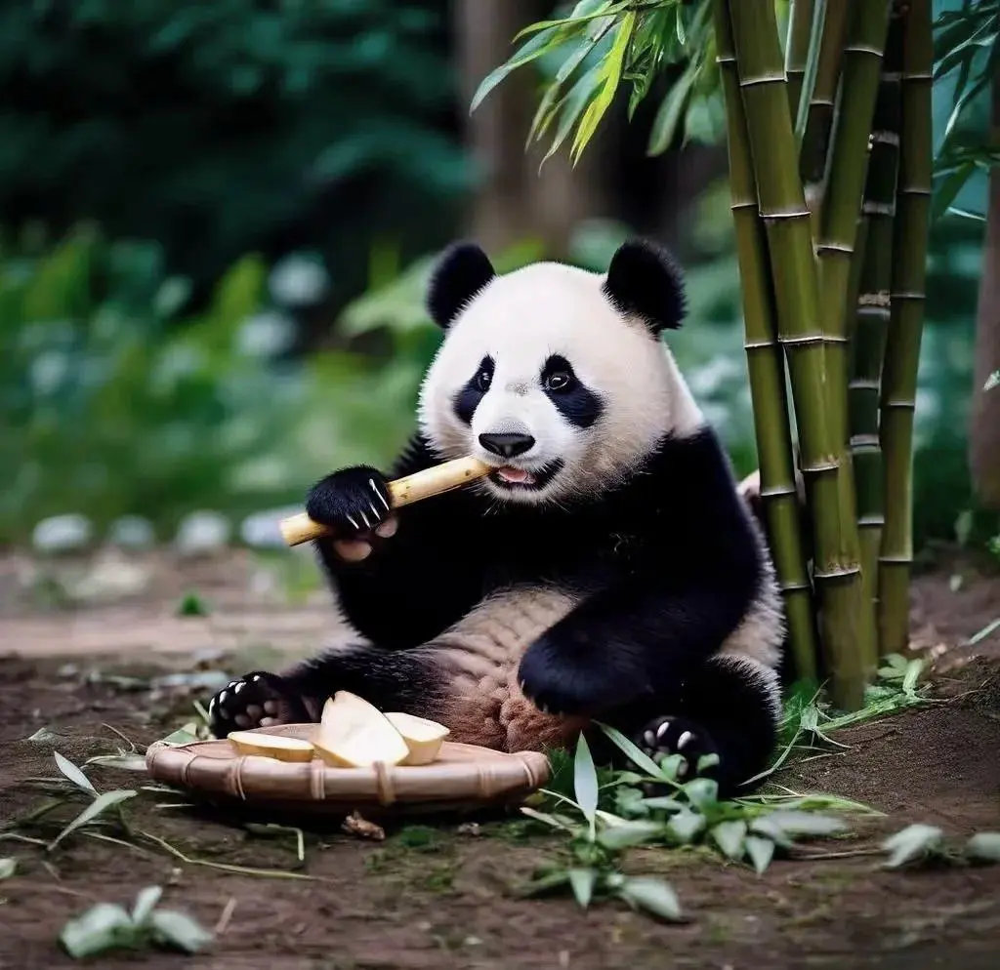

<div align="center">

# Awesome Nano Banana Prompts


</div>

## Introduction 🍌

A curated collection of creative prompts for Nano Banana (Gemini 2.5 Flash Image), designed to inspire your imagination and unlock the full potential of AI image editing and generation

Welcome to `awesome-nano-banana-prompts`! Nano Banana is a state-of-the-art image model from Google DeepMind, renowned for its powerful visual reasoning and multi-turn conversation capabilities that make image creation more intuitive and fun than ever before. This repository aims to collect and share high-quality prompts that showcase the unique strengths of Nano Banana.

## Mission ✨

*   **Inspire Creativity**: Provide a diverse range of prompt examples to help you break through creative blocks.
*   **Save Time**: Offer ready-to-use prompts that you can adapt for your projects, enabling you to achieve high-quality results quickly.
*   **Build a Community**: Create a hub for Nano Banana enthusiasts and creators to share their best ideas and learn from one another.

---

## Menu

### Directory

- [Case 1: Pet to Plastic Action Figure (by @GeminiApp)](#case-1-pet-to-plastic-action-figureby-GeminiApp)

### Cases

<!-- case1 -->
#### Case 1: [Pet to Plastic Action Figure](https://x.com/GeminiApp/status/1965842484854186159) (by [@GeminiApp](https://x.com/GeminiApp))

| Input | Output |
|:---:|:---:|
|  |  |
|  |  |

**input:** Need to upload a reference image

**prompt:**

```
turn my pet into a plastic action figure next to its packaging
```
