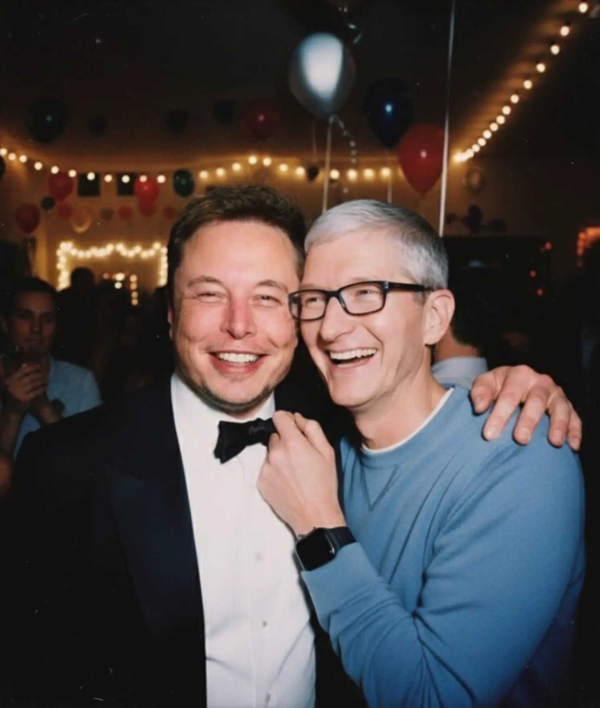

<div align="center">

# Awesome Nano Banana Pro Prompts


</div>

## Introduction 🍌

A curated collection of creative prompts for **Nano Banana Pro**, the advanced evolution of Google DeepMind's image generation technology. Designed to push the boundaries of imagination, this repository helps you unlock the full potential of AI-driven visual creation with professional-grade results.

Welcome to `awesome-nano-banana-pro-prompts`! Nano Banana Pro represents a leap forward in visual reasoning and multi-turn conversational image editing. Whether you are a designer, artist, or enthusiast, these prompts are crafted to showcase the superior detail, coherence, and flexibility of the Pro model.

## Mission ✨

* **Master Advanced Capabilities**: Provide complex and nuanced prompt examples to demonstrate the enhanced power of Nano Banana Pro.
* **Accelerate Creation**: Offer production-ready prompts that streamline workflows and deliver high-fidelity results instantly.
* **Empower the Community**: Foster a collaborative environment where creators can share professional techniques and inspire the next wave of AI art.

---

## Directory

- [Awesome Nano Banana Pro Prompts](#awesome-nano-banana-pro-prompts)
  - [Introduction 🍌](#introduction-)
  - [Mission ✨](#mission-)
  - [Directory](#directory)
  - [Cases](#cases)
    - [Case 32: Cinematic Classroom Portrait](#case-32-cinematic-classroom-portrait-by-uminimum_minimum4577)
    - [Case 31: Cinematic Urban Motion](#case-31-cinematic-urban-motion-by-uminimum_minimum4577)
    - [Case 30: Persian Carpet Portrait](#case-30-persian-carpet-portrait-by-uminimum_minimum4577)
    - [Case 29: Character Product Showcase](#case-29-character-product-showcase-by-uspecialist-pause-869)
    - [Case 28: Otaku Room Mirror Selfie](#case-28-otaku-room-mirror-selfie-by-iamemily2050)
    - [Case 27: High-Fashion Editorial Portrait](#case-27-high-fashion-editorial-portrait-by-xmliisu)
    - [Case 26: 4K Upscaling & Focus](#case-26-4k-upscaling--focus-by-alex_prompter)
    - [Case 25: Shoe Pattern Deconstruction](#case-25-shoe-pattern-deconstruction-by-linusekenstam)
    - [Case 24: Isometric Street Schematic](#case-24-isometric-street-schematic-by-amirmushich)
    - [Case 23: Real Person Transformation](#case-23-real-person-transformation-by-gizakdag)
    - [Case 22: Car Girl Portrait](#case-22-car-girl-portrait-by-xmliisu)
    - [Case 21: Recursive Artist Photography](#case-21-recursive-artist-photography-by-goodside)
    - [Case 20: Four-Panel Portrait](#case-20-four-panel-portrait-by-ix00ai)
    - [Case 19: Historical Style Evolution Grid](#case-19-historical-style-evolution-grid-by-blizaine)
    - [Case 18: Spatiotemporal Event Recreation](#case-18-spatiotemporal-event-recreation-by-minchoi)
    - [Case 17: Handwriting Math Solver](#case-17-handwriting-math-solver-by-minchoi)
    - [Case 16: Surreal Product Advertisement](#case-16-surreal-product-advertisement-by-aziz4ai)
    - [Case 15: High-End Portrait Enhancement](#case-15-high-end-portrait-enhancement-by-halimalrasihi)
    - [Case 14: Historical Photo Colorization](#case-14-historical-photo-colorization-by-codebypoonam)
    - [Case 13: Chibi Style LINE Stickers](#case-13-chibi-style-line-stickers-by-0uhly2vack23204)
    - [Case 12: Cinematic Editorial Portrait](#case-12-cinematic-editorial-portrait-by-john_my07)
    - [Case 11: Basement Gym Floor Plan](#case-11-basement-gym-floor-plan-by-adamwathan)
    - [Case 10: Train Station Movie Poster](#case-10-train-station-movie-poster-by-ai_kei75)
    - [Case 9: Comic Convention Booth](#case-9-comic-convention-booth-by-tokyo_valentine)
    - [Case 8: Manga Style Conversion](#case-8-manga-style-conversion-by-nobisiro_2023)
    - [Case 7: Character Clothing Change](#case-7-character-clothing-change-by-skirano)
    - [Case 6: Photo of Two Characters](#case-6-photo-of-two-characters-by-zho_zho_zho)
    - [Case 5: Designated Reference Pose for Character](#case-5-designated-reference-pose-for-character-by-zho_zho_zho)
    - [Case 4: Photorealistic 3D Rendering](#case-4-photorealistic-3d-rendering-by-tetumemo)
    - [Case 3: High-End Adorable Product Ads](#case-3-high-end-adorable-product-ads-by-azed_ai)
    - [Case 2: 16-Bit Platform Video Game](#case-2-16-bit-platform-video-game-by-priya_0608)
    - [Case 1: Pet to Plastic Action Figure](#case-1-pet-to-plastic-action-figure-by-geminiapp)
      
## Cases

### Case 32: [Cinematic Classroom Portrait](https://www.reddit.com/r/GenAI4all/comments/1p060gf/nano_banana_can_replace_half_your_editing_apps/) (by [u/Minimum_Minimum4577](https://www.reddit.com/user/Minimum_Minimum4577/))

| Input | Output |
|:---:|:---:|
|  |  |

**input:** Need to upload a reference image

**prompt:**

```
Cinematic portrait of the man in the picture(preserve 100% facial details of this man), vintage classroom. The camera is shot from a distance, with a small section of the chair's back visible in front, as if the photographer was taking the portrait discreetly or in a quiet moment. Soft, gol-den-yellow lighting reflects from a small window or gap in the right wall, forming diagonal lines of light that fall directly on the man's face, creating a dramatic and emotional contrast. The man sits alone in a chair, his feet resting on the desk, with a relaxed and cool expression, as if lost in thought....
```

### Case 31: [Cinematic Urban Motion](https://www.reddit.com/r/GenAI4all/comments/1p060gf/nano_banana_can_replace_half_your_editing_apps/) (by [u/Minimum_Minimum4577](https://www.reddit.com/user/Minimum_Minimum4577/))

| Input | Output |
|:---:|:---:|
|  |  |

**input:** Need to upload a reference image

**prompt:**

```
Cinematic street photography, stylish young woman in motion, urban environment, motion blur effect. Blurred pedestrians passing by, shallow depth of field, natural overcast lighting, soft pastel tones, editorial fashion photography, candid moment, dynamic movement, film aesthetic, muted colors.
```

### Case 30: [Persian Carpet Portrait](https://www.reddit.com/r/GenAI4all/comments/1p060gf/nano_banana_can_replace_half_your_editing_apps/) (by [u/Minimum_Minimum4577](https://www.reddit.com/user/Minimum_Minimum4577/))

| Input | Output |
|:---:|:---:|
|  |  |

**input:** Need to upload a reference image

**prompt:**

```
A 4K ultra-realistic portrait of (reference), framed from the chest up (not full body), designed for Instagram story or profile picture. The background is a luxurious Persian red carpet design (only behind her, not on the ground). Sunlight shines from one side, casting natural warm light across half of his face. He is wearing an elegant dress inspired by Persian carpet patterns, with authentic Iranian colors and motifs. His facial features remain unchanged. He is holding a Persian cat in her hands.
```

### Case 29: [Character Product Showcase](https://www.reddit.com/r/singularity/comments/1p2qrtk/impressed_by_nano_banana_pro_edits_text_accuracy/) (by [u/Specialist-Pause-869](https://www.reddit.com/user/Specialist-Pause-869/))

| Input | Output |
|:---:|:---:|
|   |  |
|   |  |

**input:** Need to upload a person image and a product image

**prompt:**

```
The character is Showcasing this product.
```

### Case 28: [Otaku Room Mirror Selfie](https://x.com/IamEmily2050/status/1976431328280416520) (by [@IamEmily2050](https://x.com/IamEmily2050))

| Output |
|:---:|
|  |

**input:** Need to modify part of the prompt yourself

**prompt:**

```json
{
  "scene": "mirror_selfie_otaku_pc_corner_blue",

  "subject": {
    "gender_presentation": "female",
    "age_bracket": "mid_20s",
    "ethnicity": "East Asian. ",
    "build": "slim with defined waist; natural proportions",
    "skin_tone": "light neutral",
    "hair": { "length": "very long", "style": "straight with slight wave ends", "color": "medium brown" },
    "pose": {
      "stance": "standing, slight contrapposto",
      "right_hand": "holding phone in front of face (identity obscured)",
      "left_arm": "relaxed alongside torso",
      "torso": "subtle arch; midriff visible"
    },
    "wardrobe": {
      "top": "baby-blue cropped knit cardigan, two buttons fastened; blue bralette subtly visible",
      "bottom": "denim micro-shorts with blue satin ribbon bows at both hips",
      "socks": "thigh-high blue-and-white horizontal stripes",
      "accessories": { "phone_case": "blue cute mascot case" }
    }
  },

  "environment": {
    "description": "bedroom PC corner seen in a wall mirror",
    "furnishings": [
      "white desk",
      "single monitor with pastel blue wallpaper (no readable text)",
      "mechanical keyboard with white keycaps on blue desk mat",
      "mouse on small blue mousepad",
      "PC tower to the right with blue case lighting",
      "three anime figures on/near the PC",
      "pagoda poster on wall",
      "cat-shaped desk lamp with blue accent",
      "clear glass of water",
      "tall leafy plant by window (camera-left)"
    ],
    "color_swap": "replace all former pink accents in wardrobe and room with blue (baby blue → sky/periwinkle)."
  },

  "lighting": {
    "source": "daylight from large window camera-left through sheer curtain",
    "quality": "soft diffused",
    "white_balance_K": 5200
  },

  "camera": {
    "mode": "smartphone rear camera via mirror (no portrait/bokeh mode)",
    "focal_length_eq_mm": 26,
    "distance_m": { "subject_to_mirror": 0.6, "camera_to_mirror": 0.5 },
    "exposure": { "aperture_f": 1.8, "iso": 100, "shutter_s": 0.01, "ev_comp": -0.3 },
    "focus": "torso and shorts in reflection",
    "depth_of_field": "natural smartphone DOF (deep); background readable, no artificial blur",
    "framing": {
      "aspect_ratio": "1:1",
      "crop": "top of head to mid-thigh; include desk, monitor, PC, and plant",
      "angle": "slight downward tilt from mirror viewpoint",
      "composition_notes": "keep subject centered; avoid wide-edge stretching by stepping back and cropping square"
    }
  },

  "negatives": [
    "pink/magenta accents anywhere",
    "beauty-filter/airbrushed skin; poreless look",
    "exaggerated or distorted anatomy",
    "NSFW, see-through fabric, wardrobe malfunction",
    "logos, brand names, readable UI text",
    "fake portrait-mode blur, CGI/illustration look"
  ]
}
```

### Case 27: [High-Fashion Editorial Portrait](https://x.com/xmliisu/status/1992578650978361392) (by [@xmliisu](https://x.com/xmliisu))

| Input | Output |
|:---:|:---:|
|  |  |

**input:** Need to upload a reference image

**prompt:**

```json
{
  "image_generation_parameters": {
    "resolution": "1200x1200px",
    "aspect_ratio": "1:1",
    "reference_usage": "Preserve facial features from reference image strictly"
  },
  "visual_style": {
    "genre": "High-fashion magazine editorial",
    "technique": "Direct flash photography",
    "atmosphere": "Glamorous, bold, nightlife aesthetic, paparazzi style",
    "lighting": "Hard direct flash creating sharp shadows and high contrast against a dark background"
  },
  "subject_breakdown": {
    "appearance": {
      "hair": "Long dark wavy hair, voluminous and glossy",
      "expression": "Confident, alluring, looking back over the shoulder",
      "gaze": "Direct connection with the camera"
    },
    "pose": " perched elegantly on the armchair, twisting torso to look back",
    "wardrobe": {
      "garment": "Black lace ruffled two-piece outfit (top and bottom)",
      "footwear": "Black high stiletto heels with signature red soles",
      "accessories": "None specified other than props"
    }
  },
  "environment_details": {
    "setting": "Modern luxury living room interior",
    "time_of_day": "Night",
    "furniture": "Plush charcoal grey armchair",
    "props": "Black designer handbag resting on the chair cushion beside the subject",
    "background": "Dimly lit upscale interior, out of focus"
  }
}
```

### Case 26: [4K Upscaling & Focus](https://x.com/alex_prompter/status/1992591995068645811) (by [@alex_prompter](https://x.com/alex_prompter))

| Input | Output |
|:---:|:---:|
|  |  |

**input:** Need to upload a reference image

**prompt:**

```
Upscale this image to 4K resolution, make it fully in focus.
```

### Case 25: [Shoe Pattern Deconstruction](https://x.com/LinusEkenstam/status/1992105428873056499) (by [@LinusEkenstam](https://x.com/LinusEkenstam))

| Input | Output |
|:---:|:---:|
|  |  |

**input:** Need to upload a reference image

**prompt:**

```
Create an image of the different patterns that makes up this shoe. lay them out individually against a neutral surface.
```

### Case 24: [Isometric Street Schematic](https://x.com/AmirMushich/status/1992704354990907793) (by [@AmirMushich](https://x.com/AmirMushich))

| Input | Output |
|:---:|:---:|
|  |  |

**input:** Need to upload a reference image

**prompt:**

```
Create a hand drawn isometric schematic diagram of this street.
```

### Case 23: [Real Person Transformation](https://x.com/gizakdag/status/1992518167441416230) (by [@gizakdag](https://x.com/gizakdag))

| Input | Output |
|:---:|:---:|
|  |  |

**input:** Need to upload a reference image

**prompt:**

```
Turn it into a photo of a real person.
```

### Case 22: [Car Girl Portrait](https://x.com/xmliisu/status/1991846916586438678) (by [@xmliisu](https://x.com/xmliisu))

| Output |
|:---:|
|  |

**prompt:**

```json
{
  "prompt_breakdown": {
    "subject_parameters": {
      "identity_constraint": "Preserve facial features from reference image",
      "hair": "Long, ash-brown, textured wolf cut",
      "expression": "Relaxed, dreamy, looking to the side"
    },
    "apparel": {
      "top": "Sleeveless cropped black hoodie with high collar",
      "bottom": "Faded black denim shorts, vintage distressed style, raw hem with frayed fibers",
      "footwear": "Onitsuka Tiger Mexico 66 sneakers (Yellow and Black)"
    },
    "pose_and_action": {
      "body_position": "Lying relaxed inside an open car trunk, legs bent and crossed",
      "arms": "Right arm stretched upward, left hand holding a lit cigarette near mouth",
      "action": "Smoking"
    },
    "environment_and_props": {
      "primary_container": "Trunk of a bright yellow sports car",
      "trunk_contents": "Transparent box, yellow bottle or black tube attached to the side",
      "background": "Dark outdoor nighttime setting, faint building silhouette, partial wheel of another vehicle on the left"
    },
    "technical_specs": {
      "angle": "High-angle shot (looking down)",
      "lighting": "Hard direct flash (35mm analog style), dark ambient background",
      "medium": "Flash photography, grainy film texture",
      "atmosphere": "Edgy, mysterious, candid"
    }
  }
}
```

### Case 21: [Recursive Artist Photography](https://x.com/goodside/status/1992038915881029641) (by [@goodside](https://x.com/goodside))

| Output |
|:---:|
|  |

**prompt:**

```
Amateur photograph from 1998 of a middle-aged artist copying an image by hand from a computer screen to an oil painting on stretched canvas, but the image is itself the photo of the artist painting the recursive image.
```

### Case 20: [Four-Panel Portrait](https://x.com/iX00AI/status/1992167312024310265) (by [@iX00AI](https://x.com/iX00AI))

| Input | Output |
|:---:|:---:|
|  |  |

**input:** Need to upload a reference image

**prompt:**

```
Using the uploaded reference image, generate a four-panel composition (upper-left, upper-right, lower-left, lower-right).
Keep the person’s face, hairstyle, and clothing exactly the same as in the uploaded image for all panels.
Upper-left: A close-up of her face from a high angle, with her looking up with upward eyes.
Upper-right: She raises one arm and stretches while yawning.
Lower-left: An over-the-shoulder shot from behind her, showing her hands or what she is doing.
Lower-right: She takes a selfie while sticking out her tongue.
Realistic photo style, consistent identity, natural lighting.
```

### Case 19: [Historical Style Evolution Grid](https://x.com/blizaine/status/1992586719275954558) (by [@blizaine](https://x.com/blizaine))

| Output |
|:---:|
|  |

**prompt:**

```
Make a 4×4 grid starting with the 1880s. In each section, I should appear styled according to that decade (clothing, hairstyle, facial hair, accessories). Use colors, background, & film style accordingly.
```

### Case 18: [Spatiotemporal Event Recreation](https://x.com/minchoi/status/1992624653815222509) (by [@minchoi](https://x.com/minchoi))

| Output |
|:---:|
|  |

**prompt:**

```
Create an image at 31.7785° N, 35.2296° E, April 3, 33 CE, 15:00 hours.
```

### Case 17: [Handwriting Math Solver](https://x.com/minchoi/status/1992464134248812990) (by [@minchoi](https://x.com/minchoi))

| Input | Output |
|:---:|:---:|
|  |  |

**input:** Need to upload a reference image

**prompt:**

```
Solve this on the notebook with same handwriting.
```

### Case 16: [Surreal Product Advertisement](https://x.com/aziz4ai/status/1991584744375779672) (by [@aziz4ai](https://x.com/aziz4ai))

| Input | Output |
|:---:|:---:|
|  |  |

**input:** Need to upload a reference image

**prompt:**

```
Design a creative, realistic, and surreal advertisement for the product [Product Name] of the category [Product Type]. The product appears as a hero element in the center of the frame, visually formed in a clever way that automatically reflects the brand's spirit and identity.
A clean background consistent with brand colors, soft cinematic lighting, hyper-realistic textures, precise shadows, and a sophisticated and excellent visual composition.
Add an innovative surreal touch directly related to the nature of the product without exaggeration.
Place the product logo elegantly and integrated within the composition, with a short Arabic slogan of three words automatically generated to suit the product type.
Very high quality, precise composition, strong realism, luxury style, with no additional text other than the logo and the slogan.
```

### Case 15: [High-End Portrait Enhancement](https://x.com/HalimAlrasihi/status/1991581963275342330) (by [@HalimAlrasihi](https://x.com/HalimAlrasihi))

| Input | Output |
|:---:|:---:|
|  |  |

**input:** Need to upload a reference image

**prompt:**

```
Enhance and upscale the image while keeping composition and colors identical. Eliminate blur and give the skin a lifelike, detailed look: clear pores, faint fine lines, light freckles, and realistic transitions between shadow and highlight. Maintain the tone of the light and the background, refine edge sharpness around eyes, lashes, lips and hair strands so the portrait appears like a high-end beauty photograph with natural, unplastic skin.
```

### Case 14: [Historical Photo Colorization](https://x.com/CodeByPoonam/status/1991787621916487698) (by [@CodeByPoonam](https://x.com/CodeByPoonam))

| Input | Output |
|:---:|:---:|
|  |  |

**input:** Need to upload a reference image

**prompt:**

```
Colorize this old black-and-white photograph with natural, true-to-life colors. Preserve the original facial features, textures, lighting, shadows, and fine details. Restore any faded or damaged areas without changing the people, clothing, background, or composition. Maintain the sharpness and overall quality of the original image. Add realistic skin tones, accurate clothing colors, and natural background colors while keeping everything historically appropriate. Avoid adding or removing any elements.
```

### Case 13: [Chibi Style LINE Stickers](https://x.com/0uhly2VacK23204/status/1991780261068226776) (by [@0uhly2VacK23204](https://x.com/0uhly2VacK23204))

| Input | Output |
|:---:|:---:|
|  |  |

**input:** Need to upload a reference image

**prompt:**

```
Make the character in the image chibi style.  Generate 12 kinds of LINE stickers featuring various expressions, poses, and text.
```

### Case 12: [Cinematic Editorial Portrait](https://x.com/john_my07/status/1992231812878487620) (by [@john_my07](https://x.com/john_my07))

| Input | Output |
|:---:|:---:|
|  |  |

**input:** Need to upload a reference image

**prompt:**

```
A cinematic close-up editorial portrait of a slim young adult man with the user’s face as the main subject, wearing a sleek black suit, dark blazer, and black turtleneck, , direct gaze with subtle smirk, seamless vivid orange studio background, 85mm lens, f/4, ISO 100, shutter 1/200s, cinematic dual-tone lighting with warm orange glow and cool blue rim highlights.
```

### Case 11: [Basement Gym Floor Plan](https://x.com/adamwathan/status/1992335982709055658) (by [@adamwathan](https://x.com/adamwathan))

| Input | Output |
|:---:|:---:|
|  |  |

**input:** Need to upload a reference image

**prompt:**

```
generate an overhead floor plan layout style image of my basement gym
```

### Case 10: [Train Station Movie Poster](https://x.com/AI_Kei75/status/1967498630467625127) (by [@AI_Kei75](https://x.com/AI_Kei75))

| Input | Output |
|:---:|:---:|
|  |  |

**input:** Need to upload reference image

**prompt:**

```
Create a movie poster using the original image. The genre of the movie will be determined based on the atmosphere of the original image.
Regardless of whether the original image is anime or live-action, the style and character design of the original image will be maintained as perfectly as possible. However, poses and expressions may be changed to match the poster design. Other people and objects may also be added at this time.
The final generated image will be photorealistic. This does not apply to the poster design, as it will be based on the original image.
The scenery of the underground passage of a Japanese station where the poster is posted will be recreated in a realistic image. People passing through the underground passage will be added.
The reflection of the poster is angled to make it look more realistic.
```

### Case 9: [Comic Convention Booth](https://x.com/tokyo_Valentine/status/1967174466636792287) (by [@tokyo_Valentine](https://x.com/tokyo_Valentine))

| Input | Output |
|:---:|:---:|
|  |  |

**input:** Need to upload reference image

**prompt:**

```
Erase the background and replace the characters with the following:

Cosplayers and Character Goods

Character/Motif:
Character goods based on the illustration

Hairstyle, Eyes, and Appearance:
(Focus on merchandise, not the character itself.)

Main Character: A cosplayer is holding a figurine in the center of the screen.

Location:
Comic Market (a doujinshi sales event).
A spacious booth is filled with merchandise lined up on tables and shelves. The atmosphere is filled with excitement and anticipation.

Merchandise Lineup:
• A large, approximately 100cm figure is displayed in the center of the booth, creating an eye-catching display.
• The character is displayed on an 80-inch LCD panel.
• Acrylic Stands
• Chibi Figures (Deformed)
• Body Pillows (Large, Full-Length Character Print)
• Jigsaw Puzzles (Using Character Artwork)
• Stationery (Notebooks, Pens, Clear Files, etc.)
• Desk Pads
• Plush Toys (Deformed)
Exhibition/Display:
• Goods neatly arranged throughout the booth, creating a unified look.
• Utilizing desks and shelves reminiscent of doujinshi sales events, the layout encourages fans to pick up items.
• With the energy of the visitors as a backdrop, the venue is presented as a special "fan sanctuary."
Overall Tone:
A dreamlike sales space.
While emphasizing cuteness and pop, the space evokes the unique enthusiasm of doujin events and the feeling of a "sanctuary for fan activities."
Swarms of people.

Image Quality:
Photorealistic, 4K (4000px x 3000px)
```

### Case 8: [Manga Style Conversion](https://x.com/nobisiro_2023/status/1961231347986698371) (by [@nobisiro_2023](https://x.com/nobisiro_2023))

| Input | Output |
|:---:|:---:|
|  |  |

**input:** Need to upload reference image

**prompt:**

```
Convert the input photo into a black-and-white manga-style line drawing.
```

### Case 7: [Character Clothing Change](https://x.com/skirano/status/1960343968320737397) (by [@skirano](https://x.com/skirano))

| Input | Output |
|:---:|:---:|
|  |  |

**input:**Need to upload person image and clothing image

**prompt:**

```
Replace the person's clothing in the input image with the target clothing shown in the reference image. Keep the person's pose, facial expression, background, and overall realism unchanged. Make the new outfit look natural, well-fitted, and consistent with lighting and shadows. Do not alter the person's identity or the environment — only change the clothes.
```

### Case 6: [Photo of Two Characters](https://x.com/ZHO_ZHO_ZHO/status/1967521065883856984) (by [@ZHO_ZHO_ZHO](https://x.com/ZHO_ZHO_ZHO))

| Input | Output |
|:---:|:---:|
|  |  |
|  |  |

**input:** Need to upload two reference image

**prompt:**

```
Generate a close-up Polaroid photo of two people, keeping the faces consistent. The photo has a slight blur effect and is taken indoors with a flash, just like a party, with the two people keeping an intimate and funny pose.
```

### Case 5: [Designated Reference Pose for Character](https://x.com/ZHO_ZHO_ZHO/status/1961024423596872184) (by [@ZHO_ZHO_ZHO](https://x.com/ZHO_ZHO_ZHO))

| Input | Output |
|:---:|:---:|
|  |  |
|  |  |

**input:** Need to upload two reference image

**prompt:**

```
Change the pose of the person in Picture 1 to that in Picture 2, and shoot in a professional studio.
```

### Case 4: [Photorealistic 3D Rendering](https://x.com/tetumemo/status/1965660428765417721) (by [@tetumemo](https://x.com/tetumemo))

| Input | Output |
|:---:|:---:|
|  |  |
|  |  |

**input:** Need to upload a reference image

**prompt:**

```
Please convert all of this house's floor plans into a photorealistic 3D rendering in isometric projection while keeping the overhead view, and generate the image.
```

### Case 3: [High-End Adorable Product Ads](https://x.com/azed_ai/status/1962878353784066342) (by [@azed_ai](https://x.com/azed_ai))

| Input | Output |
|:---:|:---:|
|  |  |
|  |  |

**input:** Need to upload a reference image

**prompt:**

```
A high-resolution advertising photograph of a realistic, miniature [PRODUCT] held delicately between a person's thumb and index finger.  clean and white background, studio lighting, soft shadows. The hand is well-groomed, natural skin tone, and positioned to highlight the product’s shape and details. The product appears extremely small but hyper-detailed and brand-accurate, centered in the frame with a shallow depth of field. Emulates luxury product photography and minimalist commercial style.
```

### Case 2: [16-Bit Platform Video Game](https://x.com/Priya_0608/status/1962605608642699308) (by [@Priya_0608](https://x.com/Priya_0608))

| Input | Output |
|:---:|:---:|
|  |  |
|  |  |

**input:** Need to upload a reference image

**prompt:**

```
First, ask me to upload an image of myself. Then reimagine me as a 16-Bit Video Game character and put me in a 2D 16-bit platform video game.
```

### Case 1: [Pet to Plastic Action Figure](https://x.com/GeminiApp/status/1965842484854186159) (by [@GeminiApp](https://x.com/GeminiApp))

| Input | Output |
|:---:|:---:|
|  |  |
|  |  |

**input:** Need to upload a reference image

**prompt:**

```
turn my pet into a plastic action figure next to its packaging
```
