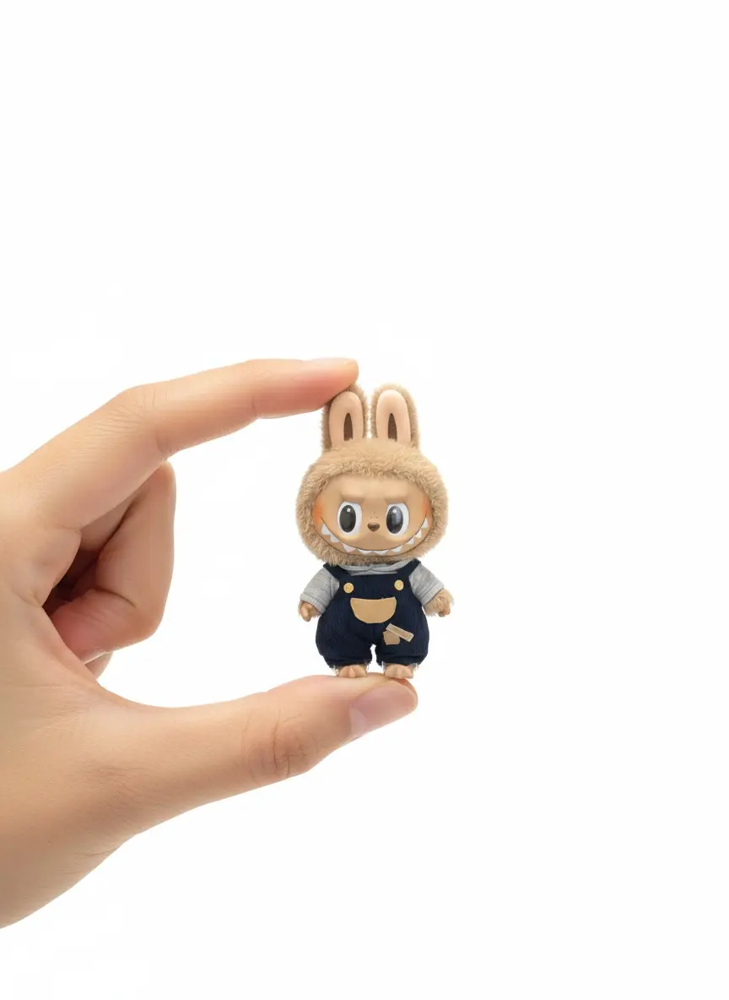

<div align="center">

# Awesome Nano Banana Prompts


</div>

## Introduction 🍌

A curated collection of creative prompts for Nano Banana (Gemini 2.5 Flash Image), designed to inspire your imagination and unlock the full potential of AI image editing and generation

Welcome to `awesome-nano-banana-prompts`! Nano Banana is a state-of-the-art image model from Google DeepMind, renowned for its powerful visual reasoning and multi-turn conversation capabilities that make image creation more intuitive and fun than ever before. This repository aims to collect and share high-quality prompts that showcase the unique strengths of Nano Banana.

## Mission ✨

*   **Inspire Creativity**: Provide a diverse range of prompt examples to help you break through creative blocks.
*   **Save Time**: Offer ready-to-use prompts that you can adapt for your projects, enabling you to achieve high-quality results quickly.
*   **Build a Community**: Create a hub for Nano Banana enthusiasts and creators to share their best ideas and learn from one another.

---

## Menu

### Directory
- [Awesome Nano Banana Prompts](#awesome-nano-banana-prompts)
  - [Introduction 🍌](#introduction-)
  - [Mission ✨](#mission-)
  - [Menu](#menu)
    - [Directory](#directory)
    - [Cases](#cases)
      - [Case 1: Pet to Plastic Action Figure](#case-1-pet-to-plastic-action-figure-by-geminiapp)
      - [Case 2: 16-Bit Platform Video Game](#case-2-16-bit-platform-video-game-by-priya_0608)
      - [Case 3: High-End Adorable Product Ads](#case-3-high-end-adorable-product-ads-by-azed_ai)

### Cases

#### Case 1: [Pet to Plastic Action Figure](https://x.com/GeminiApp/status/1965842484854186159) (by [@GeminiApp](https://x.com/GeminiApp))

| Input | Output |
|:---:|:---:|
|  |  |
|  |  |

**input:** Need to upload a reference image

**prompt:**

```
turn my pet into a plastic action figure next to its packaging
```

#### Case 2: [16-Bit Platform Video Game](https://x.com/Priya_0608/status/1962605608642699308) (by [@Priya_0608](https://x.com/Priya_0608))

| Input | Output |
|:---:|:---:|
|  |  |
|  |  |

**input:** Need to upload a reference image

**prompt:**

```
First, ask me to upload an image of myself. Then reimagine me as a 16-Bit Video Game character and put me in a 2D 16-bit platform video game.
```

#### Case 3: [High-End Adorable Product Ads](https://x.com/azed_ai/status/1962878353784066342) (by [@azed_ai](https://x.com/azed_ai))

| Input | Output |
|:---:|:---:|
|  |  |
|  |  |

**input:** Need to upload a reference image

**prompt:**

```
A high-resolution advertising photograph of a realistic, miniature [PRODUCT] held delicately between a person's thumb and index finger.  clean and white background, studio lighting, soft shadows. The hand is well-groomed, natural skin tone, and positioned to highlight the product’s shape and details. The product appears extremely small but hyper-detailed and brand-accurate, centered in the frame with a shallow depth of field. Emulates luxury product photography and minimalist commercial style.
```
